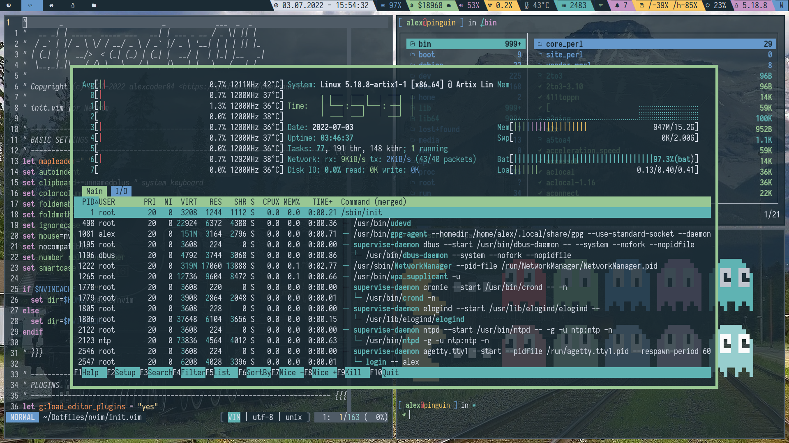

# MY .FILES



In case you didn't know, "dotfiles" are configuration files on Unix-like
operating systems like Linux. Because they start with a `.`, so they don't show
up in you file manager etc, they are often refered to as "dotfiles".

I love customizing everything I use. That's why I accumulated a lot of config
files for all kinds of programs over the time. They are organized in this
repository.

The primary aim of this repo is to maintain my personal setup, so I don't really
care about compatibility with different systems other than the ones I use.
However, you are welcome to look through my configs and integrate them into
your setup if you find something useful.

My scripts (https://github.com/alexcoder04/scripts) are required for most things
to function properly.

If you are interested in other projects I wrote that go into my setup, I
strongly recommend to take a look at this
[overview](https://alexcoder04.github.io/in-finit-y/).

## Installation system

I use a simple shell script for each "package", which overrides existing config
files with generated ones. With this generation, done by the `reconf` Python
script, I can switch to a very different desktop look very quickly or generate
customized configuration for my main production machine, Raspberry Pi, home
server etc.

The install scripts inside the packages are supposed to be called from the main
`install` script from the root of the repository by passing the name of the
program. For example:

```sh
./install zsh
```

## Licensing

The configs are written by me after studying the according documentation for the
most part and published under the GNU GPLv3 (see `LICENSE`). However, some parts
are copied from other sources, so different licensing terms may apply to them.
For foreign code, you can always find the source I got it from in the comments
or README files in the subfolders.

